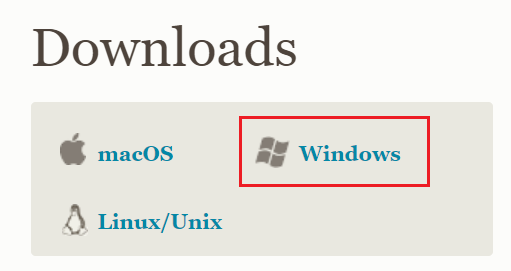

# Git的安装与卸载

# Git的安装

[下载地址](https://git-scm.com/download)

### 1. 选择安装组件

### 2. 选择Git默认编辑器

Git 安装程序里面内置了 10 种编辑器，比如 Atom、Notepad、Notepad++、Sublime Text、Visual Studio Code、Vim 等等，根据需要自行选择，点击Next下一步继续

### 3. 设置初始化新项目（仓库）的主干名字

- 第一种是让 Git 自己选择，名字是master，但是未来也有可能会改为其他名字；
- 第二种是我们自行决定，默认是<code>main</code>，当然，你也可以改为其他的名字。

一般默认第一种，点击Next 注： 第二个选项下面有个NEW！，说很多团队已经重命名他们的默认主干名为main. 这是因为2020 年非裔男子乔治·弗洛伊德因白人警察暴力执法惨死而掀起的 Black Lives Matter(黑人的命也是命)运动，很多人认为master不尊重黑人，呼吁改为main.

### 4. 调整path环境变量

注：
这步意思是指使用什么方式打开git？

- 第一种是仅从Git Bash使用Git。这个的意思就是你只能通过Git安装后的Git Bash来使用Git，其他的什么命令提示符啊等第三方软件都不行。
- 第二种是从命令行以及第三方软件进行 Git。这个就是在第一种基础上进行第三方支持，你将能够从Git Bash，命令提示符(cmd) 和 Windows PowerShell以及可以从 Windows 系统环境变量中寻找 Git 的任何第三方软件中使用 Git。推荐使用这个。
- 第三种是从命令提示符使用 Git 和可选的 Unix 工具。选择这种将覆盖 Windows 工具，如 “ find 和 sort ”。只有在了解其含义后才使用此选项。一句话，适合比较懂的人折腾。

### 5. 选择SSH可执行文件

- 第一个选项是“使用捆绑的OpenSSH”，这使用的是ssh.exe是Git自带的。
- 第二个选项是“使用外部OpenSSH”，这使用外部ssh.exe文件。Git不会捆绑安装OpenSSH相关的二进制文件，而是使用在环境变量path中找到它们。

默认选择第一项，直接点击“Next”进入下一步。

### 6. 选择HTTPS后端传输

- 第一个选项“使用OpenSSH库”，服务器证书将使用 ca-bundle.crt 文件进行验证。
- 第二个选项“使用本机Windows安全通道库”，服务器证书将使用Windows证书存储进行验证，还允许您使用公司内部分发的内部根CA证书。

作为只是用Git来访问GitHub、GitLab等网站，选择第一项即可。然后点击“Next”，进入下一步。

### 7. 配置行尾符号转换

- 第一个选项“签出 Windows 样式，提交 Unix 样式的行结尾”。签出文本文件时，Git会将LF转换为CRLF。提交文本文件时，CRLF将转换为LF。对于跨平台项目，这是Windows上的推荐设置（“ core.autocrlf”设置为“ true”）。
- 第二个选项“按原样签出，提交Unix样式的行结尾”。签出文本文件时，Git不会执行任何转换。 提交文本文件时，CRLF将转换为LF。对于跨平台项目，这是Unix上的建议设置（“ core.autocrlf”设置为“ input”）。
- 第三个选项“按原样签出，按原样提交”。当签出或提交文本文件时，Git不会执行任何转换。不建议跨平台项目选择此选项（“ core.autocrlf”设置为“ false”）。

由于我是为Windows系统安装Git，所以选择第一项。然后继续点击“Next”，进入下一步。

### 8. 配置终端模拟器与Git Bash一起使用

- 第一个选项“使用 MinTTY（MSYS2的默认终端）”。
- 第二个选项“使用 Windows 的默认控制台窗口”。

建议选择第一种，MinTTY 3功能比 cmd 多，cmd 只不过 比 MinTTY 更适合处理 Windows 的一些接口问题，这个对 Git 用处不大。
除此之外 Windows 的默认控制台窗口cmd有很多劣势，比如 cmd 具有非常有限的默认历史记录回滚堆栈和糟糕的字体编码等等。
接着点击“Next”，进入下一步。

### 9. 选择默认的“git pull”行为

“git pull”行为，是获取最新的远程仓库分支到本地，并与本地分支合并。

一般默认选择第一项，然后点击“Next”，进入下一步。

### 10. 选择凭证助手

- 第一个选项“Git凭证管理”。
- 第二个选项“不使用凭证助手”。

第一个选项是提供登录凭证帮助的，Git有时需要用户的凭据，确认身份后才能执行操作，例如：需要输入用户名和密码才能通过HTTP访问远程存储库（GitHub、GitLab…）。然后继续点击“Next”，进入下一步。

### 11. 配置额外选项

- 第一个选项“启用文件系统缓存”，就是将批量读取文件系统数据并将其缓存在内存中以进行某些操作，可以显著提升性能。这个选项默认开启。
- 第二个选项“启用符号链接”，符号链接是一类特殊的文件， 其包含有一条以绝对路径或者相对路径的形式指向其它文件或者目录的引用，类似于 Windows 的快捷方式，不完全等同 类Unix（如 Linux） 下的 符号链接。因为该功能的支持需要一些条件，所以默认不开启。

然后继续点击“Next”，进入下一步。

### 12. 配置实验性选项

以下两个选项都还是实验性功能，会存在一些小bug，建议都不要勾选。点击“Install”，开始安装。

# Git的卸载

- 在windows的设置→应用中进行卸载
- 用geek卸载