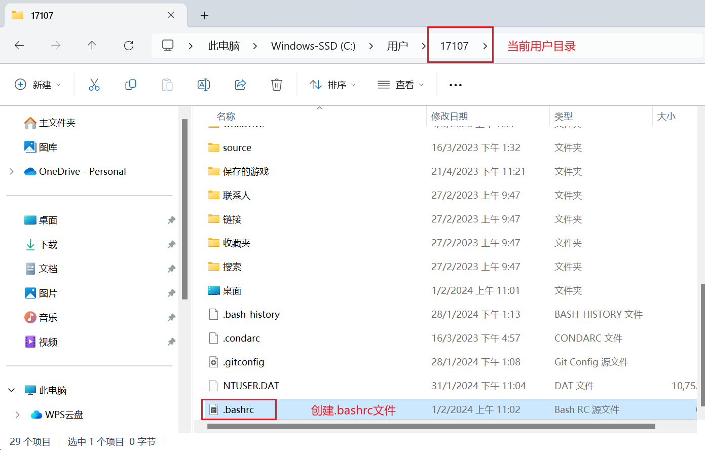

# Git基础配置与常见问题

安装好git后，首先需要设置用户名称和email地址

<aside>
💡 设置用户信息很重要，因为每次Git提交都会使用该用户信息

</aside>

1. 打开Git Bash
2. 设置用户信息
   
    `git config --global [user.name](http://user.name) "yourName"`
    
    `git config --global [user.email](http://user.email) "yourEmail"`
    
    查看配置信息
    
    `git config --global [user.name](http://user.name)`
    
    `git config --global [user.email](http://user.email)`
    

## 为常用指令配置别名（可选）

有些常用的指令参数非常多，每次都要输入好多参数，此时可以使用别名来提高效率

1. 打开用户目录，创建`.bashrc`文件
   
    部分windows系统不允许用户创建点号开头的文件，可以打开gitBash，执行`touch ~/.bashrc`
    
    - `~`表示当前用户根目录
    
    
    
2. 在`.bashrc`文件中输入如下设置别名的格式内容：
   
    ```html
    # 设置别名的格式
    alias 指令别名='指令'
    
    # 用于输出git提交日志
    alias git-log='git log --pretty=oneline --all --graph --abbrev-commit'
    # 用于输出当前目录所有文件及基本信息
    alias ll='ls -al'
    ```
    
3. 打开gitBash，执行`source ~/.bashrc`

## 解决GitBash乱码问题

1. 打开gitBash执行：`git config --global core.quotepath false`
2. 在`${git_home}/etc/bash.bashrc`文件最后加上以下两行
   
    ```html
    export LANG="zh_CN.UTF-8"
    export LC_ALL="zh_CN.UTF-8"
    ```
    

## 查看配置信息

`git config --list`


## 修改默认编辑器

方法1：直接执行`git config --global core.editor vim`

方法2：修改git的配置文件.git/config文件，在core中添加editor = vim。