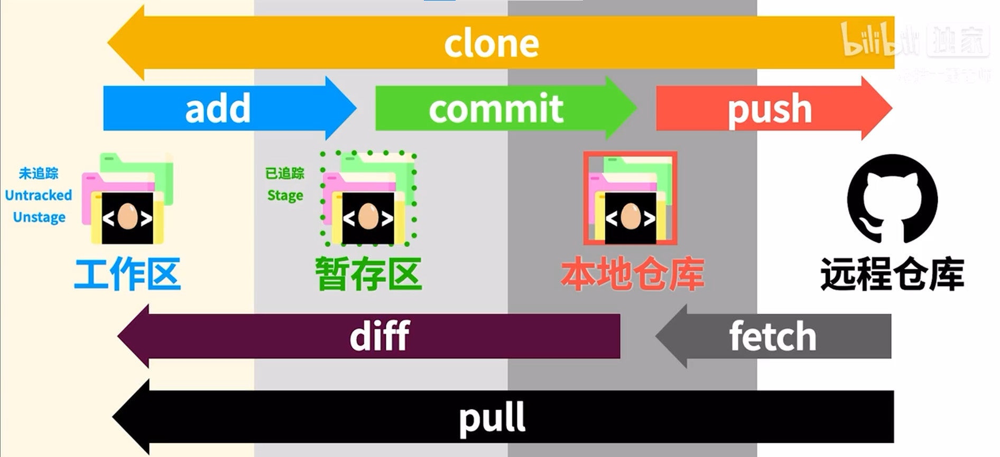
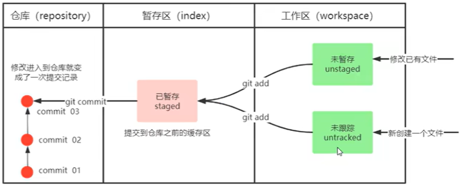

# Git常用指令

版本控制流程：





Git 工作区、暂存区和版本库概念：

- **工作区：**就是你在电脑里能看到的目录。
- **暂存区：**英文叫 stage 或 index。一般存放在 **.git** 目录下的 index 文件（.git/index）中，所以我们把暂存区有时也叫作索引（index）。
- **本地版本库（**或称**本地仓库 Repository）：**工作区有一个隐藏目录 **.git**，这个不算工作区，而是 Git 的版本库。

## 实践

### 初始化本地仓库（init）

要使用Git对我们的代码进行版本控制，首先需要获得本地仓库

1. 在电脑任意位置创建一个空目录作为本地Git仓库
2. 进入该目录，右键打开GitBash窗口
3. 执行命令`git init`
4. 若创建成功，则可在目录下看到隐藏的.git目录
- 实践
  
    

### 查看修改的状态（status）

- 作用：查看当前目录下所有文件的当前状态（unstaged、untracked、staged）
- 命令形式：`git status`
- 实例
  
    刚创建的文件是untracked状态
    
    

### 将工作区文件提交到暂存区（add）

- 作用：将准备提交到远程仓库的文件提交到暂存区
- 命令形式：`git add 文件名`
- 实例
  
    

### 将暂存区文件提交到本地仓库（commit）

- 作用：将暂存区的文件提交到本地仓库
- 命令形式：`git commit -m "注释内容"`
  
    💡 commit指令不需要带上文件名，会将暂存区的所有文件都提交到本地仓库
    `-m "注释内容"`：message，表示本次提交的版本信息，用于区别其他版本，方便回滚时找到合适的版本
    
- 实例
  
    

### 查看日志（log）

- 作用：查看日志
- 命令形式：`git log [option]`
    - options
        - `--all`：显示所有分支
        - `--pretty=oneline`：将提交信息显示为一行
        - `--abbrev-commit`：使得输出的commitId更简短
        - `--graph`以图的形式显示（用到分支时，可以较为直观显示）
- 实例
  
    

💡 因为前面设置了别名alias git-log='git log --pretty=oneline --all --graph --abbrev-commit'
所以 git-log 等价于 git log --pretty=oneline --all --graph --abbrev-commit


### 版本回退（reset、reflog）

- 作用：版本切换
- 命令形式：`git reset [--soft | --mixed | --hard] commitID`
    - commitID可以使用`git log`查看
    - --mixed 为默认，可以不用带该参数，用于重置暂存区的文件与上一次的提交(commit)保持一致，工作区文件内容保持不变
    - --hard 参数撤销工作区中所有未提交的修改内容，将暂存区与工作区都回到上一次版本，并删除之前的所有信息提交
- 实例
  
    

回退到version1后，可以看到日志中version2的提交记录已经不见了

要查看已经删除的提交记录

- `git reflog`
- 实例
  
    

### 添加文件到忽略列表（.gitignore文件）

一般来说我们总有些文件无需纳入Git的管理，也不希望它们总出现在未追踪文件列表

通常都是些自动生成的文件，比如日志文件，或者编译过程中创建的临时文件等

在这种情况下，我们可以在工作目录中创建一个名为.gitignore的文件（文件名称固定），列出要忽略的文件模式

- 实例
  
    ```html
    # 忽略所有以.txt结尾的文件
    *.txt
    
    # 但是需要追踪file01.txt文件，即使上面忽略了所有.txt结尾的所有文件
    !file01.txt
    
    # 只忽略当前目录中的TODO文件，但不忽略子目录TODO下的所有文件
    /TODO
    
    # 忽略子目录build下的所有文件
    build/
    
    # 只忽略子目录doc下的所有.txt文件，但是不忽略二级目录doc/server的.txt文件
    doc/*.txt
    
    # 忽略所有子目录doc下的pdf文件
    doc/**/*.pdf
    ```
    
    
    
    .gitignore文件中的内容是：file02.txt file03.txt
    但是file02.txt依旧会被git管理，这是因为file02.txt在.gitignore忽略file02.txt之前就已经正在被git管理了，所以此时并不能被忽略
    但是file03.txt实在被git管理前就添加到.gitignore文件中了，所以git会忽略掉file03.txt