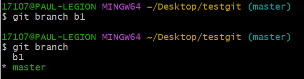

# Git分支

分支很好的体现出Git的多端协作功能

分支功能可以把工作从开发主线上分离开来进行重大Bug修改、开发新功能等，以免影响主线开发

### 查看本地分支

- 命令：`git branch`

### 创建本地分支

- 命令：`git branch 分支名`
- 实践
  
    

### 切换分支（checkout）

- 命令：`git checkout 分支名`

也可以直接切换到一个不存在的分支（创建并切换）

- 命令：`git checkout -b 分支名`
- 实践
  
    
    
    

### 合并分支（merge）

将该分支合并到当前分支

- 命令：`git merge 分支名`
- 实例
    1. 如果被合并的分支（b1）是主分支（master）的新版本（b1比master多一次提交），则masert直接更新到被合并分支所在的版本（version 4）
       
        称为合并的快进模式
        
        
        
    2. 如果被合并的分支（b1）是主分支（master）的旧版本更新过来的，合并时会进入默认编辑器
       
        

### 删除分支

**不能删除当前分支，只能删除其他分支**

`git branch -d 被删分支名`：删除分支时，需要做各种检查

`git branch -D 被删分支名`：不做任何检查，强制删除

### 解决冲突

当两个分支上对文件的修改可能存在冲突，例如同时修改了同一个文件的同一行，这时就需要手动解决冲突

1. 处理文件中冲突的地方
2. 将解决玩冲突的文件加入暂存区（add）
3. 提交到仓库（commit）
- 实例
  
    
    

### 开发中分支使用原则与流程

- master（生产）分支
  
    线上分支，主分支，中小规模项目作为线上运行的应用对应的分支
    
    一般不会删除
    
- develop（开发）分支
  
    是从master创建的分支，一般作为开发部门的主要开发分支，如果没有其他并行开发不同时期上线要求，都可以在此版本进行开发，阶段开发完成后，需要是合并到master分支，准备上线
    
    一般不会删除
    
- feature/xxx分支
  
    从develop创建的分支，一般是同期并行开发，但不同期上线时创建的分支，分支上的研发任务完成后合并到develop分支
    
    合并完后一般可以删除
    
- hotfix/xxx分支
  
    从master派生的分支，一般作为线上bug修复使用，修复完成后需要合并到master、test、develop分支
    
- 其他分支
  
    如test分支（代码测试）、pre分支（预上线分支）、…