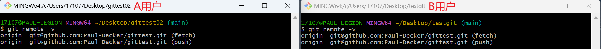

# Git远程仓库

前面我们己经知道了Gt中存在两种类型的仓库，即本地仓库和远程仓库。那么我们如何搭建Gt远程仓库呢？我们可以借助互联网上提供的一些代码托管服务来实现，其中比较常用的有GitHub、码云、GitLab等。

- gitHub(地址：[https://github.com/](https://github.com/))是一个面向开源及私有软件项目的托管平台，因为只支持Git作为唯一的版本库格式进行托管，故名gitHub
- 码云（地址：[https://gitee.com/](https://gitee.com/))是因内的一个代码托管平台，由于服务器在国内，所以相比于GitHub,码云速度会更快
- GitLab(地址：[https://about.gitlab.com/](https://about.gitlab.com/%EF%BC%89%E6%98%AF%E4%B8%80%E4%B8%AA%E7%94%A8%E4%BA%8E%E4%BB%93%E5%BA%93%E7%AE%A1%E7%90%86%E7%B3%BB%E7%BB%9F%E7%9A%84%E5%BC%80%E6%BA%90%E9%A1%B9%E7%9B%AE%EF%BC%8C%E4%BD%BF%E7%94%A8Git%E4%BD%9C%E4%B8%BA%E4%BB%A3%E7%A0%81%E7%AE%A1%E7%90%86%E5%B7%A5)）是一个用于仓库管理系统的开源项目，使用Git作为代码管理工具，并在此基础上搭建起来的wb服务，一般用于在企业、学校等内部网络搭建g1t私服。

### 创建远程仓库

1. 选择一个代码托管平台注册账号
2. 创建一个仓库
3. 连接远程仓库

### 配置SSH公钥

在连接远程仓库之前需要配置SSH公钥

[什么是SSH](https://info.support.huawei.com/info-finder/encyclopedia/zh/SSH.html)

1. 生成SSH公钥
    1. 生成公钥的指令：`ssh-keygen -t rsa`（rsa是生成密钥的算法）
    2. 不需要输入，直接不断回车即可
       
        
    
2. GitHub设置账户公钥
    1. 查看生成的公钥：`cat ~/.ssh/id_rsa.pub`
       
        
        
    2. 复制公钥到GitHub中
       
        
        
    3. 验证是否配置成功：[github官方引导网站](https://docs.github.com/en/authentication/connecting-to-github-with-ssh/testing-your-ssh-connection)
       
        `ssh -T git@github.com`
        
        
        

### 连接远程仓库

- `git remote add <remote_name> <remote_url>`：添加一个新的远程仓库。指定一个远程仓库的名称和 URL，将其添加到当前仓库中。
- `git remote`：列出当前仓库中已配置的远程仓库。
- `git remote -v`：列出当前仓库中已配置的远程仓库，并显示它们的 URL。
- `git remote rename <old_name> <new_name>`：将已配置的远程仓库重命名。
- `git remote remove <remote_name>`：从当前仓库中删除指定的远程仓库。
- `git remote set-url <remote_name> <new_url>`：修改指定远程仓库的 URL。
- `git remote show <remote_name>`：显示指定远程仓库的详细信息，包括 URL 和跟踪分支。

**git push** 命令用于从将本地的分支版本上传到远程并合并

命令格式：`git push [-f] [---set--upstream] <远程主机名> <本地分支名>:<远程分支名>`

若本地分支名与远程分支名相同，则可以省略冒号：`git push <远程主机名> <本地分支名>`

💡 远程主机名一般默认origin

当本地仓库与远程仓库同时修改一个文件产生冲突时，会push失败

`-f`参数：用本地仓库的代码强制覆盖远程仓库的代码（以本地仓库的代码为准）

`--set-upstream`参数(可缩写为`-u`)：表示推送到远端的同时，建立起和远端分支的关联关系

若当前分支已经和远端分支关联，则可以省略分支名和远端名

直接用命令`git push`将本地master/main分支推送到已关联的远端分支

使用`git branch -vv`指令查看本地分支与远端分支的关联情况

表示本地的main分支与远端的main分支已经关联，而分支b1和b2都没有与远端分支关联
此时在本地的main分支上直接用git push指令可以直接推送到远端的main分支

由于本地的b1分支并没有与远端的任何分支进行关联，所以不能直接使用git push
应先用命令`git push --set-upstream origin b1:main`将本地分支b1与远端main分支进行关联
使用命令`git push --set-upstream origin main`默认将当前分支与远端main分支进行关联

### 从远程仓库克隆（clone）

将远程仓库克隆到本地当前工作目录

命令：`git clone <仓库路径> [本地目录]`

- 仓库路径可以是HTTPS地址，也可以是SSH地址
  
    
    
- 本地目录：是可选参数。如果不填则默认创建以远程仓库的仓库名命名的目录
- 实例
  
    
    
    SSH地址，当前工作目录为桌面，则在桌面上自动创建了一个名为python-basic的目录作为本地仓库
    

### 从本地仓库抓取和拉取

抓取命令：`git fetch [remote name] [branch name]` 

- **抓取指令就是将仓库中的更新都抓取到本地，不会进行合并**
- 如果不指定远端名称和分支名，则抓取所有分支
- remote name：一般是origin
- branch name：则是远程仓库的分支
- 实例
  
    先在远程仓库中添加一个文件（表示远程仓库的一个更新）
    
    
    
    使用fetch指令后，也可以先用git diff origin/main查看当前本地分支与远端main分支的区别
    
    
    

拉取命令：`git pull [remote name] [branch name]` 

- **拉取指令就是将远端仓库的修改拉到本地并自动进行合并，等同于fetch+merge**
- 如果不指定远端名称和分支名，则拉取所有并更新当前分支
- 实例
  
    先在远程仓库中添加一个文件（表示远程仓库的一个更新）
    
    
    

### 解决远程冲突

在一段时间内，A、B用户修改了同一个文件，且修改了同一行代码，此时双方先后将修改的文件push到远程仓库时会发生合并冲突

A用户在本地修改代码后，先push到远程仓库；而B用户修改代码后也需要push到远程仓库，此时由于B用户晚于A用户push，**故需要先拉取远程仓库的更新，经过合并后才能推送到远端分支**

在B用户拉取代码时，因为A、B用户修改的是同一文件相同位置的代码，故会发生合并冲突

**远程分支也是分支，所以合并时冲突的解决方法也和解决本地分支冲突相同**

- 实例
  
    本地仓库gittest02和testgit连接的是同一个远程仓库
    分别代表A、B两个用户
    
    
    
    A用户（gittest02）在本地修改file01.txt的内容为“count=A”，然后先push到远程仓库
    
    
    
    B用户（testgit）在本地修改file01.txt的内容为”count=B”，然后尝试push到远程仓库
    
    
    
    提示B用户push失败，原因是有其他本地仓库在相同文件相同位置进行了修改并先进行了push，此时就需要用户B先用fetch或pull操作将更新了的远程仓库拉取到本地，在本地解决冲突（手动合并）后再进行push操作
    
    
    
    
    
    最后`git push`，将解决冲突后的file01.txt更新到远程仓库即可